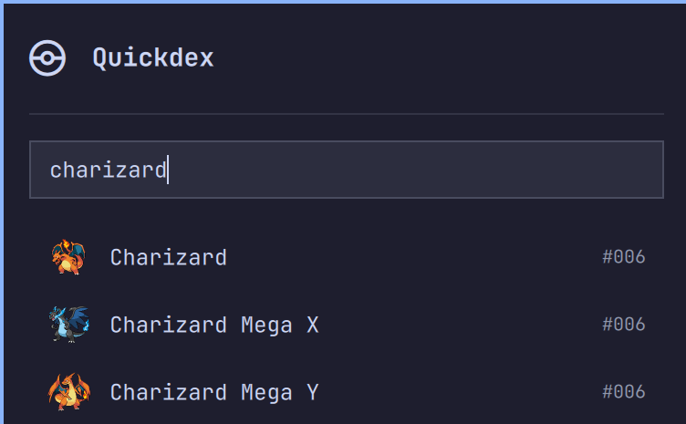
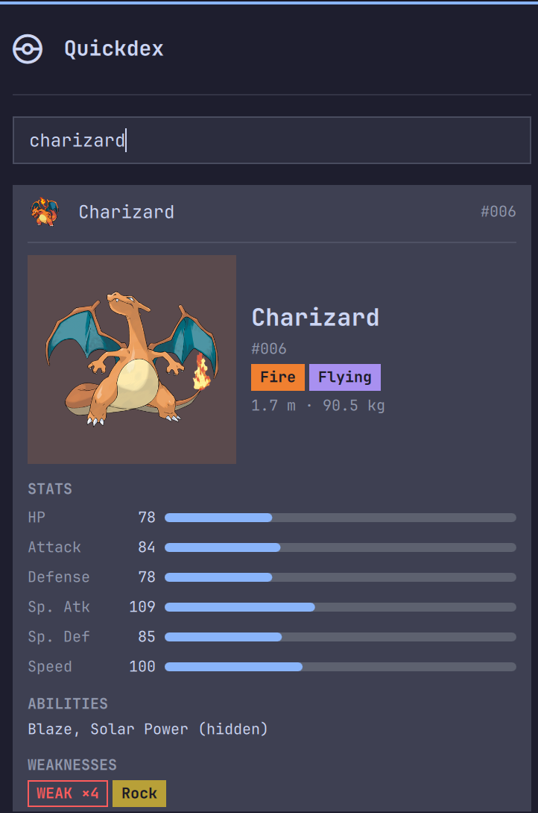

# Quickdex

Search any Pokémon and see its stats, types, and weaknesses, right from the Omarchy bar.

Click the pokeball icon, type a name, hit enter to see the full breakdown. Built for a simple reason: mid game, you want to know what a Pokémon is weak to without alt tabbing to a browser.

> Not affiliated with or endorsed by Nintendo, Game Freak, Creatures Inc., or PokeAPI.

## Screenshots

Search as you type:



Full detail view with stats, abilities, and weaknesses:



## Keyboard

With the panel open, type to search. Arrow keys move the highlighted result, or scroll the breakdown once one's open. Enter opens the full breakdown, or closes it if it's already open. Left/Right jump to the previous or next stage in a Pokémon's evolution chain while its breakdown is open. Tab shows Pokémon you've recently looked up; type again to go back to search. Escape clears the search field, escape again closes the panel.

## What you get

- Base stats (HP, Attack, Defense, Sp. Atk, Sp. Def, Speed)
- Types and abilities, with hidden abilities flagged
- Height and weight
- Official artwork
- Evolution chain, with each stage a click or arrow-key away
- Weaknesses and resistances, correctly combined for dual type Pokémon, grouped as Weak x4, Weak x2, Resists x0.5, Resists x0.25, and Immune
- Recently-viewed Pokémon, reachable with Tab
- A small chance any lookup shows a Pokémon's shiny sprite instead of its normal one — no way to trigger it on purpose

Covers the full national dex, including forms that actually differ in type (Alolan Vulpix, Mega Charizard X, and so on) as their own searchable entries. Variants that are cosmetic only, or that share the same type as the form they're based on, are left out of search so results stay clean.

Not included: move lists, flavor text, breeding info. A team weakness calculator is on the roadmap; the design is still being worked out.

## Data

Pulled from [PokeAPI](https://pokeapi.co), a free API with no account or token needed. The Pokémon list is fetched once and cached locally. Each Pokémon you look up gets cached after its first fetch, so looking it up again, even after restarting your shell, needs no network at all.

See [THIRD_PARTY_NOTICES.md](THIRD_PARTY_NOTICES.md) for attribution.

## Install

```bash
omarchy plugin add https://github.com/RolfKoenders/quickdex.git --enable
```

## Configure

The bar icon defaults to the right side of the bar. To move it:

```bash
omarchy bar move quickdex --section right
```

There's no settings screen, nothing else to configure.

## Remove

```bash
omarchy plugin remove quickdex
```

This removes the plugin but not its local cache. Delete that too if you want a clean uninstall:

```bash
rm -rf ~/.config/omarchy/quickdex
```

## License

MIT, see [LICENSE](LICENSE).
